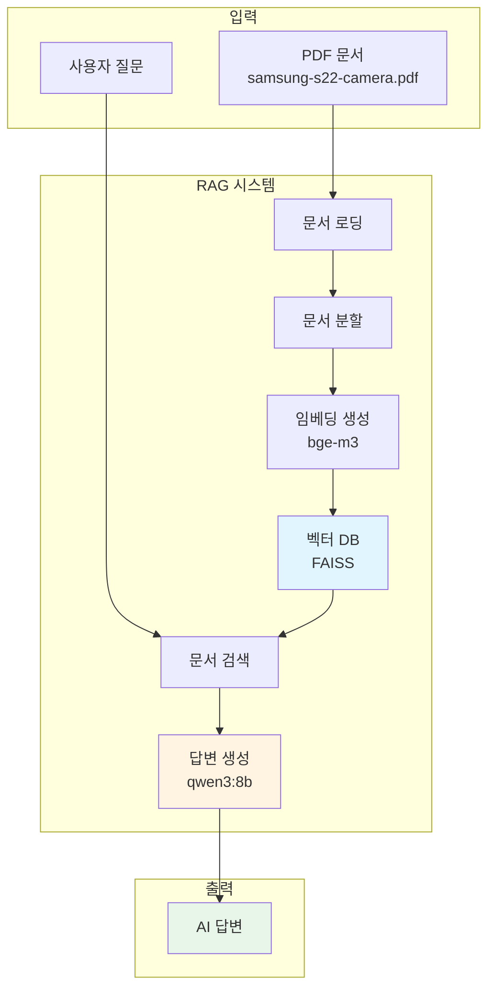
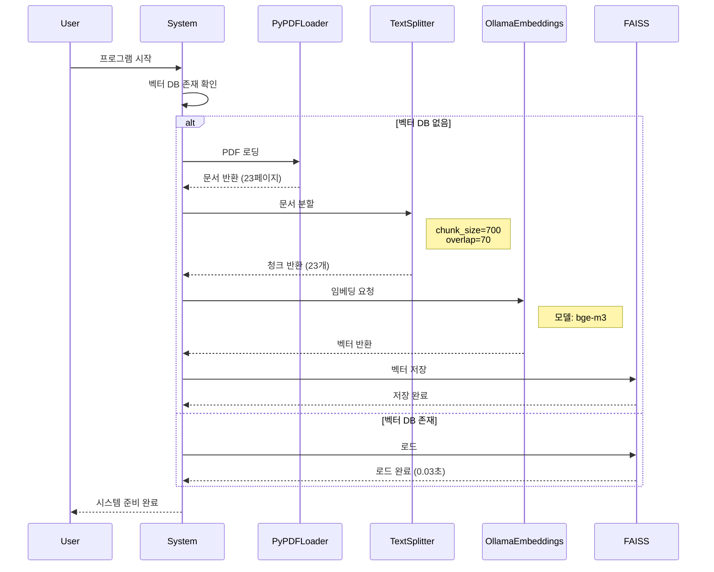
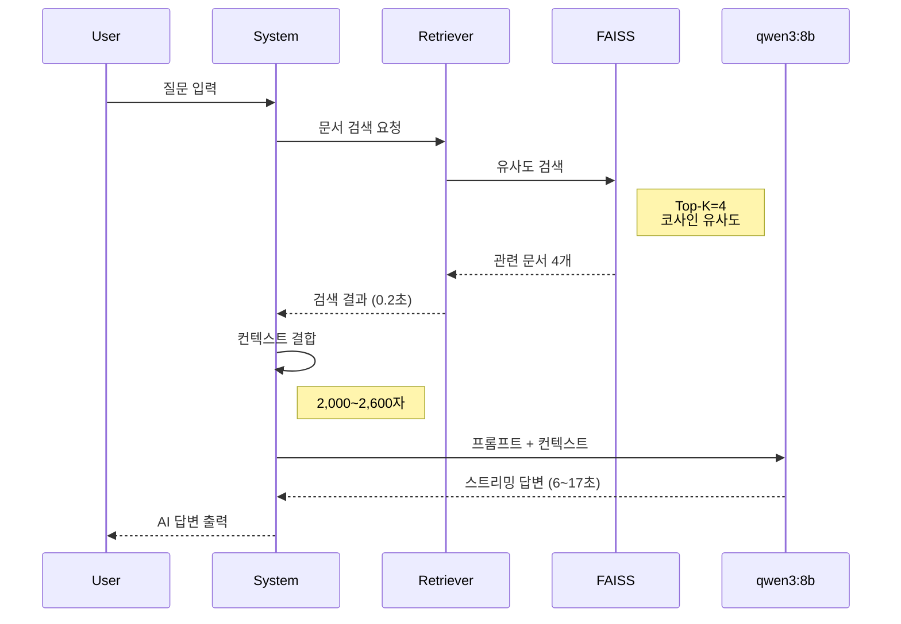
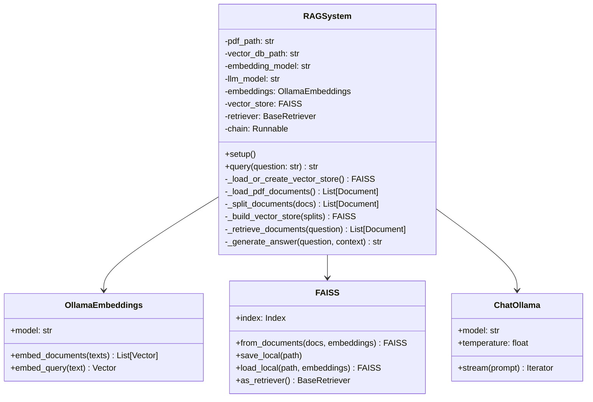
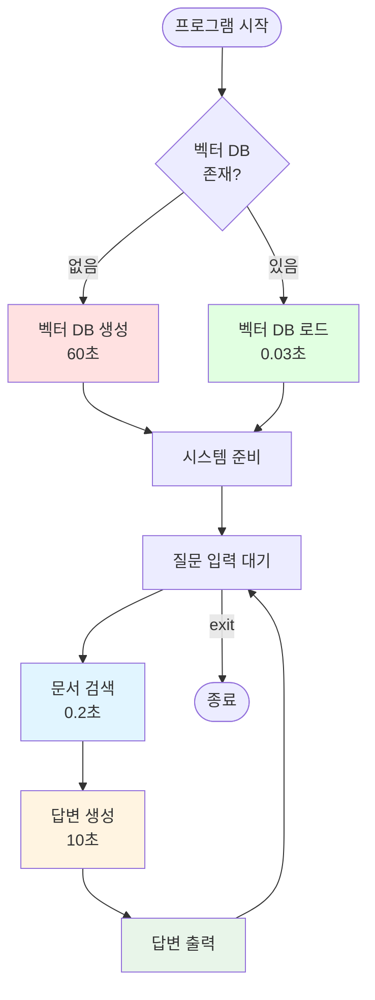

# RAG 시스템 아키텍처

## 시스템 개요

PDF 문서를 벡터 데이터베이스로 변환하고, 사용자 질문에 대해 관련 문서를 검색하여 LLM 기반 답변을 생성하는 시스템입니다.

---

## 전체 아키텍처



---

## 핵심 프로세스

### 1. 벡터 DB 생성 (초기 실행)



---

### 2. 질의응답 프로세스



---

## 핵심 API 및 컴포넌트

### 1. 벡터 DB 생성 API

```python
# 1. 문서 로딩
loader = PyPDFLoader("samsung-s22-camera.pdf")
docs = loader.load()

# 2. 문서 분할
text_splitter = RecursiveCharacterTextSplitter(
    chunk_size=700,
    chunk_overlap=70
)
splits = text_splitter.split_documents(docs)

# 3. 임베딩 & 벡터 DB 생성
embeddings = OllamaEmbeddings(model="bge-m3")
vector_store = FAISS.from_documents(
    documents=splits,
    embedding=embeddings
)

# 4. 저장
vector_store.save_local("faiss_index")
```

---

### 2. 검색 API

```python
# 1. 벡터 DB 로드
embeddings = OllamaEmbeddings(model="bge-m3")
vector_store = FAISS.load_local(
    "faiss_index",
    embeddings,
    allow_dangerous_deserialization=True
)

# 2. Retriever 생성
retriever = vector_store.as_retriever()

# 3. 문서 검색
question = "동영상 촬영 방법은?"
retrieved_docs = retriever.invoke(question)
# 결과: 4개 문서 반환 (유사도 높은 순)
```

---

### 3. 답변 생성 API

```python
# 1. 프롬프트 템플릿
prompt = PromptTemplate.from_template("""
주어진 문맥을 사용하여 질문에 답하세요.

#Question:
{question}

#Context:
{context}

#Answer:
""")

# 2. LLM 초기화
llm = ChatOllama(model="qwen3:8b", temperature=0)

# 3. 체인 생성
chain = prompt | llm | StrOutputParser()

# 4. 실행
context = "\n\n".join([doc.page_content for doc in retrieved_docs])
answer = chain.stream({
    "question": question,
    "context": context
})
```

---

## 데이터 흐름

```mermaid
flowchart LR
    subgraph "문서 처리"
        A[PDF 파일] --> B[문서 로딩]
        B --> C[텍스트 추출]
        C --> D[청크 분할<br/>700자 단위]
    end

    subgraph "벡터화"
        D --> E[임베딩 변환<br/>bge-m3]
        E --> F[벡터 DB<br/>FAISS<br/>23개 벡터]
    end

    subgraph "검색"
        G[사용자 질문] --> H[질문 임베딩]
        H --> I[유사도 검색]
        F --> I
        I --> J[Top-4 문서]
    end

    subgabraph "답변"
        J --> K[컨텍스트 생성]
        K --> L[LLM 프롬프트]
        L --> M[qwen3:8b]
        M --> N[AI 답변]
    end

    style F fill:#e1f5ff
    style M fill:#fff4e1
    style N fill:#e8f5e9
```

---

## 클래스 구조



---

## 주요 설정

### 모델 설정
```python
EMBEDDING_MODEL = "bge-m3"       # 임베딩 모델
LLM_MODEL = "qwen3:8b"           # 언어 모델
LLM_TEMPERATURE = 0              # 결정론적 출력
```

### 청크 설정
```python
CHUNK_SIZE = 700                 # 청크 크기 (문자)
CHUNK_OVERLAP = 70               # 청크 오버랩 (문자)
```

### 검색 설정
```python
TOP_K = 4                        # 검색 문서 수 (기본값)
SIMILARITY_METRIC = "cosine"     # 유사도 측정 (코사인)
```

---

## 성능 특성

### 초기화
- **벡터 DB 생성** (최초): ~60초
- **벡터 DB 로드** (이후): ~0.03초

### 검색
- **문서 검색**: 0.16~0.23초
- **검색 문서 수**: 4개 (고정)
- **컨텍스트 크기**: 2,000~2,600자

### 답변 생성
- **LLM 응답**: 5~17초
- **평균 응답**: ~10초
- **출력 방식**: 스트리밍

---

## 시스템 흐름 요약



---

## 핵심 기술 스택

| 컴포넌트 | 기술 | 역할 |
|---------|------|------|
| 문서 로딩 | PyPDFLoader | PDF 파싱 |
| 텍스트 분할 | RecursiveCharacterTextSplitter | 청크 생성 |
| 임베딩 | bge-m3 (Ollama) | 벡터 변환 |
| 벡터 DB | FAISS | 유사도 검색 |
| LLM | qwen3:8b (Ollama) | 답변 생성 |
| 체인 구성 | LangChain LCEL | 파이프라인 |

---

## 확장 포인트

### 1. 문서 형식 확장
```python
# 다양한 로더 지원
from langchain_community.document_loaders import (
    TextLoader,      # TXT
    CSVLoader,       # CSV
    UnstructuredMarkdownLoader,  # MD
)
```

### 2. 벡터 DB 변경
```python
# Chroma, Pinecone 등
from langchain_community.vectorstores import Chroma

vector_store = Chroma.from_documents(
    documents=splits,
    embedding=embeddings,
    persist_directory="./chroma_db"
)
```

### 3. 하이브리드 검색
```python
# BM25 + 벡터 검색
from langchain.retrievers import EnsembleRetriever

ensemble = EnsembleRetriever(
    retrievers=[bm25_retriever, faiss_retriever],
    weights=[0.5, 0.5]
)
```
